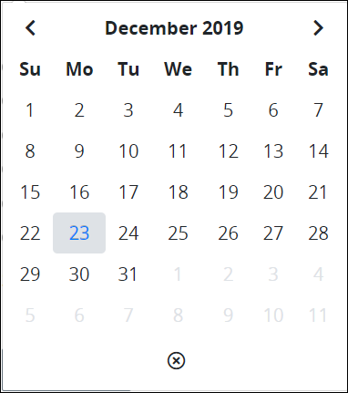

# What is a Request Variable?

## Overview

ProcessMaker uses two types of variables, both of which appear in [Requests](../using-processmaker/requests/what-is-a-request.md). Request variables represent placeholders for Request data that change as the Request routes through its Process.

## ProcessMaker Magic Variables

ProcessMaker uses a set of global variables that become part of each Request. ProcessMaker uses these Magic Variables to store ProcessMaker [user](../processmaker-administration/add-users/what-is-a-user.md), [Process](../designing-processes/viewing-processes/what-is-a-process.md), and Request related data for all Requests. During an in-progress Request, these ProcessMaker Magic Variables are updated. See [Reference Magic Variables in ProcessMaker Assets](../designing-processes/reference-global-variables-in-your-processmaker-assets.md).

## Variables Created in Each Request

Variables are often unique to each [Request](../using-processmaker/requests/what-is-a-request.md). As each Request participant does an assigned [Task](../using-processmaker/task-management/what-is-a-task.md) in a Request, that Task displays a [ProcessMaker Screen](../designing-processes/design-forms/what-is-a-form.md). The ProcessMaker Screen displays the information that Task assignee must enter, review, and/or approve.

The interactive fields in a ProcessMaker Screen are called controls. Examples of these controls are the [Line Input](../designing-processes/design-forms/screens-builder/control-descriptions/line-input-control-settings.md), [Checkbox](../designing-processes/design-forms/screens-builder/control-descriptions/checkbox-control-settings.md), and [Date Picker](../designing-processes/design-forms/screens-builder/control-descriptions/date-picker-control-settings.md) controls. Many of these controls have a setting called **Variable Name**, which represents the content entered or stored in that ProcessMaker Screen control. Request variables have the following attributes:

* The **Variable Name** setting represents a variable name.
* The value of that Request variable is one of the following:
  * The information the Task assignee enters into a control using that variable name, which then becomes part of the data for that Request when that Task assignee completes the Task.
  * During a Request, the value of that Request variable is replaced by another Request variable, a [ProcessMaker Script](../designing-processes/scripts/what-is-a-script.md), a third-party data source, or a ProcessMaker Magic Variable.

Therefore, every Request variable has two components:

* **Name of the Request variable:** The name of the Request variable is how that Request variable is referenced anytime during a Request from ProcessMaker assets such as [Process models](../designing-processes/process-design/), ProcessMaker Screens, ProcessMaker Scripts, and [ProcessMaker Data Connectors](../designing-processes/data-connector-management/what-is-a-data-connector.md).
* **Value of the Request variable:** The Request variable contains a value. Some Request variables can require a specific data type, such as whether a setting accepts only alphanumeric characters, integers, a date-type format, or currency. Alternatively, the Request variable value may contain one of the following values:
  * **Null**: The value **null** means that Request variable contains no value.
  * **`true`**: The value `true` is a positive state of the **Boolean** data type for that Request variable, such as when a Checkbox control in a ProcessMaker Screen is selected.
  * **`false`**: The value `false` is a negative state of the **Boolean** data type for that Request variable, such as when a Checkbox control in a ProcessMaker Screen is not selected.

Below are a few ways to use Request variables:

* **Read a Request variable:** A ProcessMaker Screen may be designed to read information that has been entered in a different ProcessMaker Screen during the same Request. To read a Request variable, the ProcessMaker Screen designer references the Request variable name; during a Request, the value of that Request variable displays in any Screen control that uses that Request variable name, which was likely defined in the **Variable Name** setting of the control from which the Screen designer intends to read its value. Therefore, this requires coordination between ProcessMaker Screen designers who work on different Screens in your organization to define names for Request variables. Alternatively, the [ProcessMaker Vocabularies package](../package-development-distribution/package-a-connector/vocabularies.md) helps address this problem.
* **Replace the value of one Request variable from another:** Similar to reading a Request variable, a Request variable's value may be replaced by another Request variable's value. See [Example](what-is-a-request-variable.md#example).
* **Store the value of a ProcessMaker Magic Variable to a Request variable:** The value of a ProcessMaker Magic Variable can replace that of a Request variable. For example, store a ProcessMaker Magic Variable's value at a particular time during a Request for later reference elsewhere in that Request since the ProcessMaker Magic Variable's value may change as the Request continues.
* **Replace the value of a Request variable from a third-party data source:** Using a ProcessMaker Data Connector to access data from a third-party data source, such as an Application Program Interface \(API\), get the value from a specified resource, and then replace a Request variable's existing value.
* **Create a new Request variable during the Request using a ProcessMaker Script:** ProcessMaker Scripts can create new Request variables that do not exist in that Request, and then assign a value to that Request variable.

## Example

Consider how two [Request](../using-processmaker/requests/what-is-a-request.md) variables may be used in a simplified [Process](../designing-processes/viewing-processes/what-is-a-process.md) an organization uses to request leave, such as for a vacation. This simplified example does not discuss the procedural steps how to create these Request variables. This example is intended for conceptual purposes only to better understand how Request variables function in a Request.

### Example Description

Suppose the following Request variables exist in two different [ProcessMaker Screens](../designing-processes/design-forms/what-is-a-form.md) for different [Tasks](../using-processmaker/task-management/what-is-a-task.md) in this request leave Process:

* The person requesting leave, called the requester, uses a [Date Picker](../designing-processes/design-forms/screens-builder/control-descriptions/date-picker-control-settings.md) control in the ProcessMaker Screen for the Task to request the dates for his vacation. Call this Request variable `BeginLeave`, which is the **Variable Name** setting value for the Date Picker control in that ProcessMaker Screen. An example is shown below.  
* In the Process, there is a person who is assigned the Task in the Process to approve, revise, or reject the leave request. This person may use a different Date Picker control in a different ProcessMaker Screen to suggest a different date to begin the requester's leave. In this example, the request approver suggests a later date to start the requester's vacation, shown below.  Call this Request variable `BeginLeaveRevision`.  

### Requester Submits Leave Request

The requester for this example Process uses a Date Picker control to select leave beginning on December 16, as shown in the [example description](what-is-a-request-variable.md#example-description).

### Approver Reviews the Leave Request

After completing the Task to [request dates for leave](what-is-a-request-variable.md#requester-submits-leave-request), the person assigned the Task to approve, revise, or reject the leave request receives a [notification](../using-processmaker/notifications.md) to do this Task. When she opens the Task to see the ProcessMaker Screen showing the proposed date to begin leave, stored in the `BeginLeave` Request variable, she thinks that the date the requester's vacation should begin be later in that month. In her Task, she selects a later date from the Date Picker control that stores its value in the `BeginLeaveRevision` Request variable.

### Request Routes Back to Requester for Revision

Suppose that the Process is designed such that the Request returns to the requester to suggest the revised date\(s\) for leave if the `BeginLeave` Request variable value does not match the `BeginLeaveRevision` Request variable value. Furthermore, when the Request returns to the requester, the `BeginLeaveRevision` value replaces that of the `BeginLeave` value so that when the requester views the Task showing the leave request change, he sees the date she adjusted to begin his vacation.

## Related Topics







