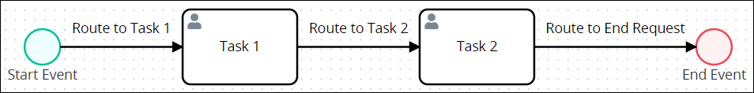
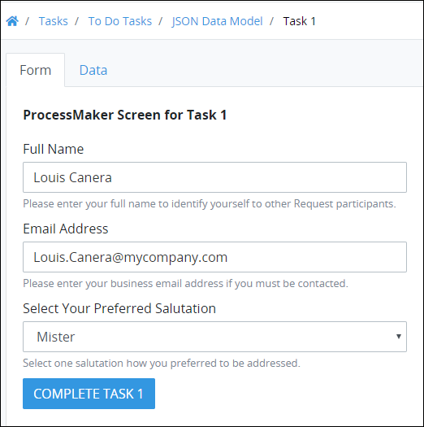
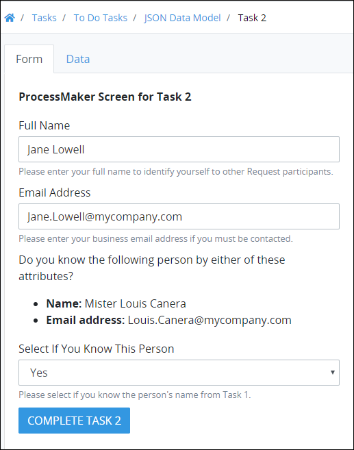
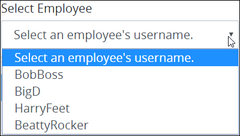

# What is JSON?

## Overview

JavaScript Object Notation \(JSON\) is a lightweight format to store and transport data. JSON is a text-only format that can be read and written using any plain text editor. Furthermore, JSON can be read from any modern programming language, making this a flexible format to store and share information regardless of which programming language may need to read it. JSON uses the `.json` file extension when in a stand-alone file. ProcessMaker assets, such as Processes, ProcessMaker Screens, ProcessMaker Scripts use the `.json` file extension when a ProcessMaker asset is exported from ProcessMaker.

ProcessMaker uses JSON format for the following reasons:

* JSON is easy for humans to read and write in any text editor. Likewise, since any modern programming language can parse and generate JSON, this format is "programming-language agnostic."
* JSON's lightweight format is a standard to store and transport data between web servers and clients, making it ideal for ProcessMaker to exchange data quickly with third-party data sources such as Application Program Interfaces \(APIs\). JSON is the "modern language of the Internet."
* JSON's lightweight format is highly scalable to allow large amounts of ProcessMaker Request data to accumulate without affecting performance.
* JSON's flexible structure allows Request data be schema-less JSON objects: unique for each Request without adhering to a specific structure.

## Schema-Less JSON

ProcessMaker uses a schema-less JSON data model from which to read, write, and store Request data. Since the JSON data model is schema-less \(meaning that it does not require a specific schema or structure from which ProcessMaker assets must conform\), the JSON data model is structured from the JSON objects and arrays in ProcessMaker assets used in a Request: the **Variable Name** setting values in a ProcessMaker Screen or Request variables a ProcessMaker Script creates. When an in-progress Request routes through the Process, Request data aggregates into the JSON data model, thereby becoming Request data.

A schema-less JSON data model does not require conforming to a rigid schema or structure that must indefinitely meet the business or technical needs for an enterprise system through the life of that system. Schema-less JSON allows any person, organization, or enterprise to customize ProcessMaker to meet their own needs, regardless of with which legacy or contemporary systems ProcessMaker may exchange data.

However, schema-less JSON can store both structured and unstructured data to enforce data conformity if necessary. For example, use the ProcessMaker Vocabularies package to enforce JSON schemas when specific information and data types are required for the business solution, such as ensuring that all personal and banking information is submitted for a loan request before the loan can be considered.

## Example of a Request

To demonstrate how Request data accumulates in a schema-less JSON data model, consider how data accumulates in a Request for the following example Process below. This Process serves no business solution but is for demonstration purposes only. This demonstration is not intended to learn how ProcessMaker uses JSON in Request data, understand how BPMN 2.0 elements function nor to demonstrate each step in this example Process. This example only demonstrates the following:

* how data accumulates in a schema-less JSON data model after a Request starts
* how Request data can be referenced in another point in time of that Request

## Example Demonstration

Below is the Process model for this example demonstration. This Process contains the following BPMN 2.0-compliant elements that represent steps in the Process:

* **Start Event:** The **Start Event** element starts the Request for this Process.
* **Task 1: Task 1** represents work for a Request participant. Louis Canera is the ProcessMaker user assigned this Task.
* **Task 2: Task 2** is assigned to a different Request participant, Jane Lowell.
* **End Event**: The **End Event** element ends the Request.



After the Request starts, the Request routes to **Task 1**. The ProcessMaker user assigned this Task, Louis Canera, opens the following ProcessMaker Screen that is the form, enters information to fulfill this Task, and then submits the Screen to complete this Task.


After Louis Canera completes the Task in this example Process, the Request routes to **Task 2**. The ProcessMaker user assigned this Task, Jane Lowell, opens the following ProcessMaker Screen, enters information to fulfill this Task, and then submits the Screen to complete this Task.


After Jane Lowell completes **Task 2**, the Request ends.

## Request Data Accumulation

After Louis Canera completed **Task 1** by submitting the ProcessMaker Screen, the following JSON object automatically becomes part of the JSON data model for that Request.

```text
{
    "CompleteTask1": null,
    "FullNameTask1": "Louis Canera",
    "SalutationTask1": "Mister",
    "EmailAddressTask1": "Louis.Canera@mycompany.com"
}
```

The Request data contains the information entered into each ProcessMaker Screen control and is referenced in the JSON data model by the **Variable Name** setting value for each control. See [JSON Syntax Components](https://app.gitbook.com/@processmaker/s/temp-internal-only/~/drafts/-M6dFUef-ytmO2eNo7co/foundation-of-request-data/what-is-json#json-syntax-components) for information how ProcessMaker uses JSON.

The **Variable Name** settings, as well as other configurable settings, display when a ProcessMaker Screen is edited but not during a Request. For demonstration purposes, the following table lists the type of control in this ProcessMaker Screen used for **Task 1** \(from top to bottom\), the **Variable Name** setting of each control, and the information in each control when Louis Canera submitted the ProcessMaker Screen to complete that Task. The **Variable Name** setting values may be anything as long as they comply with value requirements for that control type \(generally, alphanumeric characters\).

| Type of Control | Variable Name Setting | Information in Control |
| :--- | :--- | :--- |
| Line Input | `FullNameTask1` \(labeled **Full Name**\) | Louis Canera |
| Line Input | `EmailAddressTask1` \(labeled **Email Address**\) | Louis.Canera@mycompany.com |
| Select List | `SalutationTask1` \(labeled **Select Your Preferred Salutation**\) | Mister |
| Submit Button | `CompleteTask1` \(labeled **Complete Task 1**\) | `null` \(no defined value\) |



For demonstration purposes, most controls are similar in **Task 2** step as in **Task 1**; however, their V**ariable Name** setting values are different so that the values that Jane Lowell enters into those controls can be unique and become part of the JSON data model for that Request. The following table lists the type of control in this ProcessMaker Screen used for **Task 2** \(from top to bottom\), the **Variable Name** setting of each control, and the information in each control when Jane Lowell submitted the ProcessMaker Screen to complete that Task.

| Type of Control | Variable Name Setting | Information in Control |
| :--- | :--- | :--- |
| Line Input | `FullNameTask2` \(labeled **Full Name**\) | Jane Lowell |
| Line Input | `EmailTask2` \(labeled **Email Address**\) | Jane.Lowell@mycompany.com |
| Select List | `VerifyPersonTask2` \(labeled **Select If You Know This Person**\) | Yes |
| Submit Button | `CompleteTask2` \(labeled **Complete Task 2**\) | `null` \(no defined value\) |


After Jane Lowell completed **Task 2** by submitting the ProcessMaker Screen, additional JSON properties automatically become part of the existing JSON object in that Request's data model. The following JSON shows the accumulated Request data between **Task 1** and **Task 2**.

```text
{
    "EmailTask2": "Jane.Lowell@mycompany.com",
    "CompleteTask1": null,
    "CompleteTask2": null,
    "FullNameTask1": "Louis Canera",
    "FullNameTask2": "Jane Lowell",
    "SalutationTask1": "Mister",
    "EmailAddressTask1": "Louis.Canera@mycompany.com",
    "VerifyPersonTask2": "Yes"
}
```

Since the JSON data model contains the **Variable Name** setting values for ProcessMaker Screen controls used in that Request \(as well as other variables introduced to the Request from other ProcessMaker assets such as ProcessMaker Scripts that run code and/or access third-party data\), the JSON data model is flexible, does not require to follow a specified structure or schema, and may be unique for every Request \(even for those started from the same Process\). These attributes describe the flexibility a schema-less JSON data model provides ProcessMaker and those who design business solutions using ProcessMaker.

## Referencing Request Data

Notice how Request data entered in one Task can be referenced from another Task. When Jane Lowell viewed the ProcessMaker Screen used for **Task 2**, she saw the information that Louis Canera entered about himself in **Task 1**:

* his full name \("Louis Canera"\)
* his email address \("Louis.Canera@mycompany.com"\)
* his preferred salutation \("Mister"\)



Reference Request data by using the **Variable Name** setting value for the ProcessMaker Screen control to get its value. In doing so, follow these guidelines:

1. Locate the ProcessMaker Screen control you want to display the Request data from another control \(to display that control's content\).
2. Within that control's content to display the Request data, use [mustache syntax](https://mustache.github.io/mustache.5.html) both preceding and after the **Variable Name** setting value of the control to get its content.

Consider how Request data from **Task 1** displays in **Task 2**. A Rich Text control, used to display rich-style text, images, and hyperlinks in Task 2, displayed the following to Jane Lowell when she did this Task during the Request:

Do you know the following person by either of these attributes?

* **Name**: Mister Louis Canera 
* **Email address**: Louis.Canera@mycompany.com

When the ProcessMaker Screen was designed for use in Task 2, the Rich Text control contains the following content:

> Do you know the following person by either of these attributes?
>
> * **Name:** {{ SalutationTask1 }} {{ FullNameTask1 }}
> * **Email address:** {{ EmailAddressTask1 }}

Notice how the **Variable Name** setting values from ProcessMaker Screen controls for **Task 1** have mustache syntax preceding and after those setting values. Mustache syntax is represented by the  characters that serve as a placeholder for Request variable values. During the Request, when the ProcessMaker Screen for **Task 2** displays, ProcessMaker fills the Request variable placeholders with the content of those variables.

| Type of Control | Variable Name Setting | Information in Control |
| :--- | :--- | :--- |
| Line Input | `FullNameTask1` \(labeled **Full Name**\) | Louis Canera |
| Line Input | `EmailAddressTask1` \(labeled **Email Address**\) | Louis.Canera@mycompany.com |
| Select List | `SalutationTask1` \(labeled **Select Your Preferred Salutation**\) | Mister |


In technical terms for this example, each Request data is a JSON element and contains two components:

* **JSON element key name:** The JSON element key name is the **Variable Name** setting value for a ProcessMaker Screen control.
* **JSON element value:** The value of that JSON element is the information entered into each ProcessMaker Screen control. If the JSON element is referenced in another ProcessMaker asset using mustache syntax, the value of that JSON element enters that ProcessMaker asset. ProcessMaker assets that can reference Request data include:
  * a ProcessMaker Screen control for a different Task 
  * a ProcessMaker Screen control for a Manual Task 
  * a ProcessMaker Screen for a ProcessMaker Collection record 
  * a ProcessMaker Script a ProcessMaker Data Connector

## JSON Syntax

This section describes JSON syntax, how they may be used in ProcessMaker Request data, and examples. ProcessMaker does not require you to write JSON. ProcessMaker is easy to use, and allows you to design customized processes and end-user experiences without understanding how to read or write JSON. However, understanding how JSON represents Request data in ProcessMaker may take your designing potential to the next level.


Information in this section is not intended to teach JSON nor be comprehensive in its general use. This information is intended for non-technical ProcessMaker designers. There are many resources to learn JSON, including [w3schools.com](https://www.w3schools.com/js/js_json_intro.asp).


See the following sections:

* [JSON Objects](https://app.gitbook.com/@processmaker/s/temp-internal-only/~/drafts/-M6dFUef-ytmO2eNo7co/foundation-of-request-data/what-is-json#json-objects)
* [JSON Arrays](https://app.gitbook.com/@processmaker/s/temp-internal-only/~/drafts/-M6dFUef-ytmO2eNo7co/foundation-of-request-data/what-is-json#json-arrays)
* [JSON Dot Notation](https://app.gitbook.com/@processmaker/s/temp-internal-only/~/drafts/-M6dFUef-ytmO2eNo7co/foundation-of-request-data/what-is-json#json-dot-notation)
* [JSON Data Types](https://app.gitbook.com/@processmaker/s/temp-internal-only/~/drafts/-M6dFUef-ytmO2eNo7co/foundation-of-request-data/what-is-json#json-data-types)

## JSON Objects

JSON is composed of objects. A JSON object is a set of keys with their corresponding values, each pair called an element, that do not have a specific order. Consider the example Request data submitted for a Task in the following ProcessMaker Screen.


A JSON object represents this Request data as follows.

```text
{
    "CompleteTask1": null,
    "FullNameTask1": "Louis Canera",
    "SalutationTask1": "Mister",
    "EmailAddressTask1": "Louis.Canera@mycompany.com"
}
```

This JSON object contains four elements. Example: `"FullNameTask1": "Louis Canera"`

Note the following:

* Opening and closing curly brackets `({` and `})` represent the beginning and end of the JSON object, respectively.
* A comma \(`,`\) must follow each element except the last element.
* The elements in the JSON object are indented from the curly brackets for easier legibility. The formatting and indention have no effect on how a computer script parses \(reads\) the JSON.

Each JSON object element contains two components:

* **Key name:** The key name references the information in its object element. The key name is to the left of the colon \(`:`\) in each JSON object element. The JSON object element always has double quotation marks \(`"`\) surrounding the key name. Key names cannot have spaces in them. In the example above, `"FullNameTask1"` is the key name to reference this JSON object element. 

**How You Use This in ProcessMaker:** 

In ProcessMaker, when you configure the settings for many ProcessMaker Screen controls, a setting called Variable Name is required. This setting is required because the value you enter into the Variable Name setting for a control becomes the key name for that object element in the Request data. In the Request data, use the key name to reference the information in that ProcessMaker Screen control..

* **Value:** The value is to the right of the colon. The value represents the information entered into the ProcessMaker Screen control when the Task using that Screen completes. In the example above, `"Louis Canera"` is the element's value. **How You Use This in ProcessMaker:** If the element's key name is referenced in another ProcessMaker asset using [mustache syntax](https://mustache.github.io/mustache.5.html) \(described in [Referencing Request Data](https://app.gitbook.com/@processmaker/s/temp-internal-only/~/drafts/-M6dFUef-ytmO2eNo7co/foundation-of-request-data/what-is-json#referencing-request-data)\), the value of that element enters into that ProcessMaker asset. Element values require specific syntax based on its [data type](https://en.wikipedia.org/wiki/Data_type). Every key name must have a corresponding value. If the element has no value, use `null` to mean that the element contains no value; JSON elements cannot be undefined, so `null` defines that element with no value. See [JSON Object Property Value Syntax for Common Data Types](https://app.gitbook.com/@processmaker/s/temp-internal-only/~/drafts/-M6dFUef-ytmO2eNo7co/foundation-of-request-data/what-is-json#json-object-property-value-syntax-for-common-data-types).

## JSON Arrays

A JSON array is an ordered list of values or objects. Square brackets \(`[ ]`\) surround the JSON array. ProcessMaker reads \(parses\) the order of these values from left to right. Values in an array may be of any data type JSON supports. Below is an example of a JSON array using values of the **String** data type.

```text
["Sunday", "Monday", "Tuesday", "Wednesday", "Thursday", "Friday", "Saturday"]
```

Arrays can be in a JSON object. In the example below, the JSON object element Products has a value that is an array of three values: `Product 1`, `Product 2`, and `Product 3`.

```text
{
    "CompanyName": "Company",
    "Offices": 2,
    "Headquarters": "Newark, NJ",
    "Branch": "Denver, CO",
    "Products": ["Product 1", "Product 2", "Product 3"]
}
```

The formatting and indention are for easier legibility and have no effect on how a computer script parses \(reads\) the JSON. See [Example Request Data](https://app.gitbook.com/@processmaker/s/temp-internal-only/~/drafts/-M6dFUef-ytmO2eNo7co/foundation-of-request-data/what-is-json#example-request-data) for a JSON array displaying Request data.

## JSON Dot Notation

JSON dot notation references object elements and array values in sentence format using periods \(`.`\) instead of structured bracket format. As a ProcessMaker designer, you may need to read or replace one of the following:

* [the value corresponding with a JSON object element's key name](https://app.gitbook.com/@processmaker/s/temp-internal-only/~/drafts/-M6dFUef-ytmO2eNo7co/foundation-of-request-data/what-is-json#json-dot-notation-to-reference-the-value-for-an-object-elements-key-name)
* [a specific value in a JSON array](https://app.gitbook.com/@processmaker/s/temp-internal-only/~/drafts/-M6dFUef-ytmO2eNo7co/foundation-of-request-data/what-is-json#json-dot-notation-to-reference-a-specific-value-in-an-array)

Consider the sample Request data below.

```text
{
    "CompanyName": "Company",
    "Offices": 2,
    "Headquarters": "Newark, NJ",
    "Branch": "Denver, CO",
}
```

Suppose that you need to read the value for the `Headquarters` element to replace that value with one from a third-party data source. Use the following JSON dot notation to reference that object element's value:

```text
data.Headquarters
```

Note the following:

* Begin the JSON dot notation with `data.`, which indicates to reference ProcessMaker Request data.
* The JSON dot notation indicates the nested location of the JSON object from which to reference the element's key name. Each nested location is separated by a period \(`.`\) to indicate each nested level. In this example, the object element from which to reference its value is not nested.
* In square brackets \(`[ ]`\), indicate from which element key name to reference its value. Therefore, use `Headquarters` to reference the value corresponding with that element's key name.

## JSON Dot Notation to Reference a Specific Value in an Array

Consider the sample Request data below, where the Products element has an array as a value. That array contains three values: `Product 1`, `Product 2`, and `Product 3`.

```text
{
    "CompanyName": "Company",
    "Offices": 2,
    "Headquarters": "Newark, NJ",
    "Branch": "Denver, CO",
    "Products": ["Product 1", "Product 2", "Product 3"]
}
```

Suppose that you need to read the second value in the `Products` array to enter that value into a ProcessMaker asset, such as a Line Input control in a ProcessMaker Screen to display that value. Use the following JSON dot notation to reference that value:

```text
data.Products[1]
```

Note the following:

* Begin the JSON dot notation with `data.`, which indicates to reference ProcessMaker Request data.
* The JSON dot notation indicates the nested location of the JSON array from which to reference its value. Each nested location is separated by a period \(`.`\) to indicate each nested level. In this example, the array from which to reference its value is not nested.
* In square brackets \(`[` `]`\), indicate which value in the array to reference beginning with `0`. Therefore, to reference the second value in this array, use `1` in this JSON dot notation.

## JSON Data Types

JSON supports six [data types](https://en.wikipedia.org/wiki/Data_type). A data type, common to programming languages, specifies how to interpret that data. Syntax indicates how to interpret \(parse\) that data. For example, JSON interprets `"1"` and `1` differently: the former is a **String** data type, while the latter is an **Integer** data type.

Each data type requires specific syntax to be valid. Below is the syntax for each data type.

<table>
  <thead>
    <tr>
      <th style="text-align:left">Data Type</th>
      <th style="text-align:left">Syntax</th>
      <th style="text-align:left">Example</th>
    </tr>
  </thead>
  <tbody>
    <tr>
      <td style="text-align:left"><b>String</b>
      </td>
      <td style="text-align:left">
        <p>Double quotes (<code>&quot;</code>).</p>
        <p>Request data stores the <b>Date</b> and <b>Datetime</b> data types as the <b>String</b> data
          type. The Date Picker control can indicate dates using the <b>Date</b> and <b>Datetime</b> data
          types.</p>
      </td>
      <td style="text-align:left"><code>{&quot;FullName&quot;: &quot;Louis Canera&quot;}</code>
      </td>
    </tr>
    <tr>
      <td style="text-align:left"><b>Integer</b> or <b>Floating Point</b>
      </td>
      <td style="text-align:left">n/a</td>
      <td style="text-align:left"><code>{&quot;Age&quot;: 25}</code>
      </td>
    </tr>
    <tr>
      <td style="text-align:left">Object as a value</td>
      <td style="text-align:left">
        <p>Curly brackets (<code>{</code>  <code>}</code>).</p>
        <p>JSON objects as values follow the same syntax as JSON objects.</p>
      </td>
      <td style="text-align:left">
        <p><code>{<br /></code>
        </p>
        <p><code>&quot;CEO&quot;: {</code>
        </p>
        <p><code>&quot;name&quot;: &quot;Bob&quot;,</code>
        </p>
        <p><code>&quot;email&quot;: &quot;bob@company.com&quot;,</code>
        </p>
        <p><code>&quot;location&quot;: &quot;Newark&quot;}<br /></code>
        </p>
        <p><code>}</code>
        </p>
      </td>
    </tr>
    <tr>
      <td style="text-align:left">Array as a value</td>
      <td style="text-align:left">
        <p>Curly brackets surround the array, represented with surrounding square
          brackets (<code>[</code>  <code>]</code>).</p>
        <p>See <a href>JSON Arrays</a> for information about arrays.</p>
      </td>
      <td style="text-align:left">
        <p><code>{<br /></code>
        </p>
        <p><code>&quot;employees&quot;: [&quot;Bob&quot;, &quot;Ann&quot;, &quot;Tom&quot;]<br /></code>
        </p>
        <p><code>}</code>
        </p>
      </td>
    </tr>
    <tr>
      <td style="text-align:left"><b>Boolean</b>
      </td>
      <td style="text-align:left">
        <p><code>true</code> represents a positive state, such as a control is selected.</p>
        <p><code>false</code> represents a negative state, such as a control is not
          selected.</p>
      </td>
      <td style="text-align:left"><code>{&quot;LeaveRequestProvided&quot;: true}</code>
      </td>
    </tr>
    <tr>
      <td style="text-align:left"><b>Null</b> (no value)</td>
      <td style="text-align:left">n/a</td>
      <td style="text-align:left"><code>{&quot;SubmitButton&quot;: null}</code>
      </td>
    </tr>
  </tbody>
</table>## Example Request Data

Below is an example of Request data that contains at least one attribute for each supported JSON data type.

JSON objects and arrays can be nested inside each other. ProcessMaker Request data may be nested in the following circumstances:

* **Business data has multiple items:** The Request data that represents that business information contains multiple items. For example, each item of that business information may have been entered into a Task's ProcessMaker Screen or that business data was read from a third-party data source and aggregated into the Request data.
* **Each item in that business data contains multiple attributes:** Each item in that data contains multiple attributes that describe each item. In the Request data, each item, which is a JSON object, may contain the same object elements that describe each item of the business data.

```text
{
    "CompanyName": "Company",
    "Offices": 2,
    "Headquarters": "Newark, NJ",
    "Branch": "Denver, CO",
    "Products": ["Product 1", "Product 2", "Product 3"],
    "Employees": [
        {
            "FirstName": "Bob",
            "LastName": "Doe",
            "Username": "BobBoss",
            "Office": "Headquarters",
            "Email": "bob@company.com",
            "Title": "CEO",
            "Founder": true,
            "YearsAtCompany": 20,
            "StockOptions": 1000,
            "Hobbies": null
        },
        {
            "FirstName": "Diane",
            "LastName": "Smith",
            "Username": "BigD",
            "Office": "Headquarters",
            "Email": "diane@company.com",
            "Title": "Vice President",
            "Founder": false,
            "YearsAtCompany": 15,
            "StockOptions": 750,
            "Hobbies": ["biking", "Zen motorcycle repair", "writing"]
        },
        {
            "FirstName": "Harry",
            "LastName": "Jones",
            "Username": "HairyFeet",
            "Office": "Branch",
            "Email": "harry@company.com",
            "Title": "Office Manager",
            "Founder": false,
            "YearsAtCompany": 10,
            "StockOptions": null,
            "Hobbies": ["movies", "underwater basketweaving", "reading"]
        },
        {
            "FirstName": "Beatty",
            "LastName": "Gonzales",
            "Username": "BeattyRocker",
            "Office": "Headquarters",
            "Email": "beatty@company.com",
            "Title": "Designer",
            "Founder": false,
            "YearsAtCompany": 5,
            "StockOptions": null,
            "Hobbies": ["cooking", "sewing", "softball", "growing peppers"]
        }
    ]
}
```

Note the following:

* Opening and closing curly brackets \(`{` and `}`\) represent the beginning and end of the JSON object, respectively.
* Opening and closing square brackets \(`[` and `]`\) represent the beginning and end of the JSON array, respectively.
* A comma \(`,`\) must follow each element in each JSON object except the last element. For example, `"CompanyName": "Company"` is an element in this JSON object.
* A comma must follow each JSON object in the array except the last object. For example, the following is the first nested JSON object in the `Employees` array:

```text
        {
            "FirstName": "Bob",
            "LastName": "Doe",
            "Username": "BobBoss",
            "Office": "Headquarters",
            "Email": "bob@company.com",
            "Title": "CEO",
            "Founder": true,
            "YearsAtCompany": 20,
            "StockOptions": 1000,
            "Hobbies": null
        },
```

* The bracket formatting and indentation are for easier legibility and have no effect on how a computer script parses \(reads\) the JSON.

In this example, the JSON array `Employees` contains four values, each a nested JSON object, that describe the employees at Company. Each nested JSON object contains nine elements with the following key names in this order:

* `FirstName`
* `LastName`
* `Username`
* `Office`
* `Email`
* `Title`
* `Founder`
* `YearsAtCompany`
* `StockOptions`


**How Can I Use This Request Data?**

As a ProcessMaker designer, you can use Request data during that Request. Consider the following examples how the sample Request data above can be used in Process design:

* In a Task: A Select List control in a ProcessMaker Screen displays a set of options as either check boxes or a multi-select drop-down menu for a Task. Configure the Select List control to get all JSON element values corresponding with the key name Username from the Employees array so that the Select List control displays BobBoss, BigD, HarryFeet, and BeattyRocker as options in the Task.

 ****

* **In a Process model:** During a Request, assign a Task to the ProcessMaker user that has the job title "Vice President" based on the `Title` key name in all nested JSON objects.


