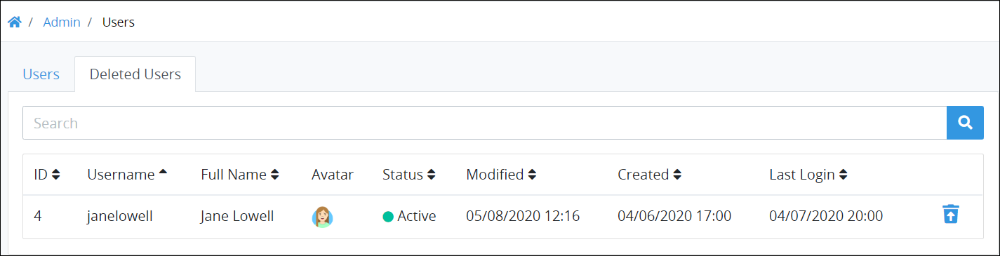

# View Deleted User Accounts

## Overview

After a [ProcessMaker user](../../what-is-a-user.md) account is [deleted](remove-a-user-account.md#delete-a-processmaker-user-account), that user account displays in the **Deleted Users** tab where that user account may be restored. A restored ProcessMaker user account has the same status as when it was deleted. When a ProcessMaker user account is restored, the person assigned to that user account may log on to ProcessMaker if that user account is of Active status.

## View All Deleted ProcessMaker User Accounts 

ProcessMaker displays all ProcessMaker user accounts in one table that ProcessMaker Administrators throughout your organization have deleted. This makes it easy to manage deleted ProcessMaker user accounts.


Your ProcessMaker user account or group membership must have the "Users: View Users" permission to view the list of deleted users unless your user account has the **Make this user a Super Admin** setting selected.

See the [Users](../../../permission-descriptions-for-users-and-groups.md#users) permissions or ask your ProcessMaker Administrator for assistance.


Follow these steps to view all ProcessMaker deleted user accounts in your organization:

1. [Log on](../../../../using-processmaker/log-in.md#log-in) to ProcessMaker.
2. Click the **Admin** option from the top menu. The **Users** tab displays.
3. Click the **Deleted Users** tab.

The **Deleted Users** tab displays the following information in tabular format about deleted ProcessMaker user accounts:‌

* **Username:** The **Username** column displays the username associated with the deleted ProcessMaker user account.
* **Full Name:** The **Full Name** column displays the full name associated with deleted ProcessMaker user account.
* **Avatar:** The **Avatar** column displays the avatar image for the deleted ProcessMaker user account. If there is not an avatar image for the deleted ProcessMaker user account, that person's full name initials display. See [Change Your User Avatar](https://app.gitbook.com/@processmaker/s/processmaker/~/drafts/-M6pyhiitiiByYueG53g/using-processmaker/profile-settings#change-your-user-avatar).
* **Status:** The **Status** column displays one of the following statuses for the deleted ProcessMaker user account:
  * **Active:** An Active ProcessMaker user account is one in which a person can use his or her user account to log on to ProcessMaker. Note that deleted ProcessMaker user accounts cannot be used to log on.
  * **Inactive:** An Inactive ProcessMaker user account is one in which a person cannot use his or her user account to log on to ProcessMaker regardless of whether the account is deleted.
* **Modified:** The **Modified** column displays the date and time the deleted ProcessMaker user account was last modified. The time zone setting to display the time is according to the ProcessMaker instance unless your [user profile's](https://app.gitbook.com/@processmaker/s/processmaker/~/drafts/-M6pyhiitiiByYueG53g/using-processmaker/profile-settings#change-your-processmaker-settings) **Time zone** setting is specified.
* **Created:** The **Created** column displays the date and time the deleted ProcessMaker user account was created. The time zone setting to display the time is according to the ProcessMaker instance unless your [user profile's](https://app.gitbook.com/@processmaker/s/processmaker/~/drafts/-M6pyhiitiiByYueG53g/using-processmaker/profile-settings#change-your-processmaker-settings) **Time zone** setting is specified.
* **Last Login:** The **Last Login** column displays the date and time the deleted ProcessMaker user last logged on to ProcessMaker. If the ProcessMaker user account has not logged on, the following indicator displays: **n/a**. The time zone setting to display the time is according to the ProcessMaker instance unless your [user profile's](https://app.gitbook.com/@processmaker/s/processmaker/~/drafts/-M6pyhiitiiByYueG53g/using-processmaker/profile-settings#change-your-processmaker-settings) **Time zone** setting is specified.


### Search for a Deleted ProcessMaker User Account

Use the [Search](../search-for-a-user.md#search-for-a-processmaker-user-account) field to filter deleted ProcessMaker user accounts that display.

### No Deleted ProcessMaker User Accounts?

If no ProcessMaker user accounts are deleted, the following message displays: **No Data Available**.

### Display Information the Way You Want It

[Control how tabular information displays](../../../../using-processmaker/control-how-requests-display-in-a-tab.md), including how to sort columns or how many items display per page.


## Restore a Deleted ProcessMaker User Account

Follow these steps to restore a deleted ProcessMaker user account:

1. [View all ProcessMaker user accounts.](../view-all-users.md) The **Users** tab displays.
2. Click the **Deleted Users** tab. All deleted ProcessMaker user accounts display.
3. Click the **Restore User** icon for the ProcessMaker user account to restore. The **Caution** screen displays to confirm the restoration of the ProcessMaker user account.  
4. Click **Confirm**. The following message displays: **The user was restored**. This ProcessMaker user account moves from the **Deleted Users** tab to the **Users** tab. The person assigned to that ProcessMaker user account may log on to ProcessMaker if that user account is of Active status.

## Related Topics









