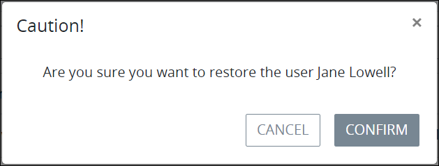

# View Deleted User Accounts

## Overview

After a [ProcessMaker user](../../what-is-a-user.md) account is [deleted](remove-a-user-account.md#delete-a-processmaker-user-account), that user account displays in the **Deleted Users** tab where that user account may be restored. A restored ProcessMaker user account has the same status as when it was deleted. When a ProcessMaker user account is restored, the person assigned to that user account may log on to ProcessMaker if that user account is of Active status.

## Restore a Deleted ProcessMaker User Account

Follow these steps to restore a deleted ProcessMaker user account:

1. [View all ProcessMaker user accounts.](../view-all-users.md) The **Users** tab displays.
2. Click the **Deleted Users** tab. All deleted ProcessMaker user accounts display.
3. Click the **Restore User** icon for the ProcessMaker user account to restore. The **Caution** screen displays to confirm the restoration of the ProcessMaker user account.  
4. Click **Confirm**. The following message displays: **The user was restored**. This ProcessMaker user account moves from the **Deleted Users** tab to the **Users** tab. The person assigned to that ProcessMaker user account may log on to ProcessMaker if that user account is of Active status.

## Related Topics









